# Microsoft Sentinel Threat Detection

A hands-on Security Operations Center (SOC) lab built on Microsoft Sentinel. This project simulates a real-world endpoint compromise scenario and demonstrates end-to-end threat detection using KQL queries, custom analytics rules, automated incident generation, and monitoring workbooks.

---

## 🧪 Lab Overview

**Platform:** Microsoft Azure / Microsoft Sentinel  
**Workspace:** `Sentinel-Workspace`  
**Endpoint:** `DESKTOP-JL0Q094` (Windows)  
**Simulated User:** `Philip Price`  
**Attack Scenario:** Insider/endpoint threat — recon, credential abuse, and PowerShell evasion

The lab covers the full detection lifecycle:
1. Generating suspicious activity on an endpoint
2. Querying raw logs with KQL
3. Writing analytics rules to automate detection
4. Triaging generated incidents
5. Visualizing trends in custom workbooks

---

## 🔍 Attack Simulation & Detection Walkthrough

### 1. Initial Recon Activity

The simulated attacker ran classic discovery commands on the endpoint.

**KQL Query — Recon Commands (Event ID 4688):**
```kql
SecurityEvent
| where EventID == 4688
| where CommandLine has_any ("whoami", "ipconfig", "net user", "net localgroup")
| project TimeGenerated, Account, CommandLine
| sort by TimeGenerated desc
```

**Results:** Three recon commands detected — `whoami`, `whoami.exe`, and `ipconfig /all` — all executed by `Philip Price` within seconds of each other.

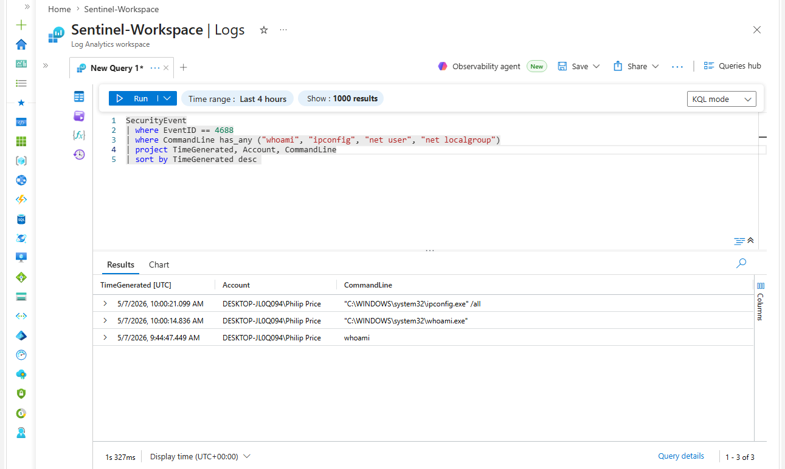

---

### 2. PowerShell Encoded Command

An encoded PowerShell command was executed, a common technique to obfuscate malicious payloads (MITRE T1027 / T1059.001).

**KQL Query:**
```kql
SecurityEvent
| where EventID == 4688
| where CommandLine has "EncodedCommand"
| project TimeGenerated, Computer, Account, NewProcessName, CommandLine
| sort by TimeGenerated desc
```

**Results:** One hit — `WindowsPowerShell` launched with `-EncodedCommand` flag by `Philip Price` on `DESKTOP-JL0Q094`.

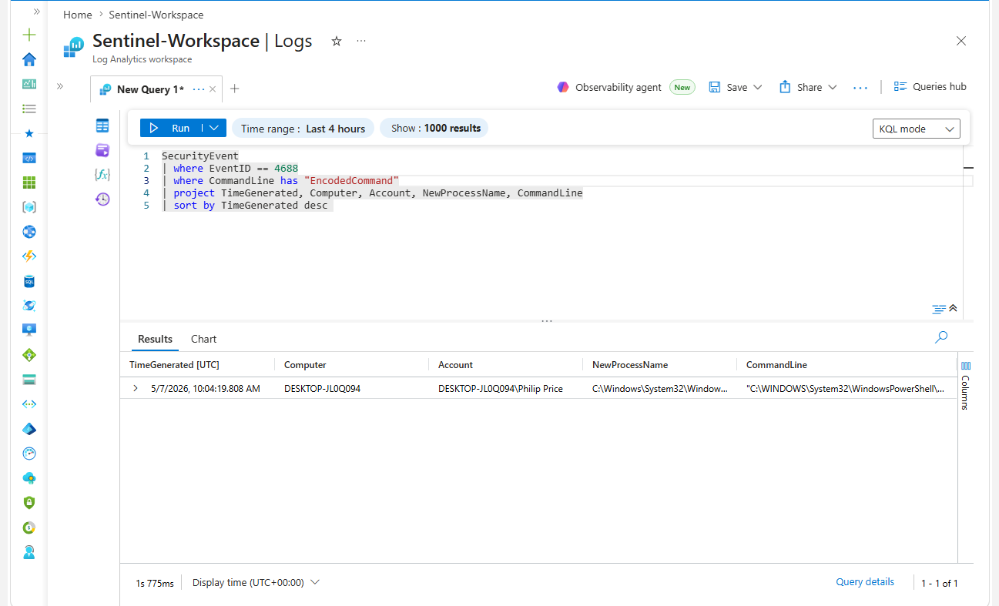

---

### 3. Execution Policy Bypass

The attacker used `-ep bypass` to circumvent PowerShell's execution policy restrictions.

**KQL Query:**
```kql
SecurityEvent
| where EventID == 4688
| where CommandLine has "-ep bypass"
| project TimeGenerated, Computer, Account, NewProcessName, CommandLine
| sort by TimeGenerated desc
```

**Results:** Confirmed `powershell.exe -ep bypass` executed by `Philip Price`.

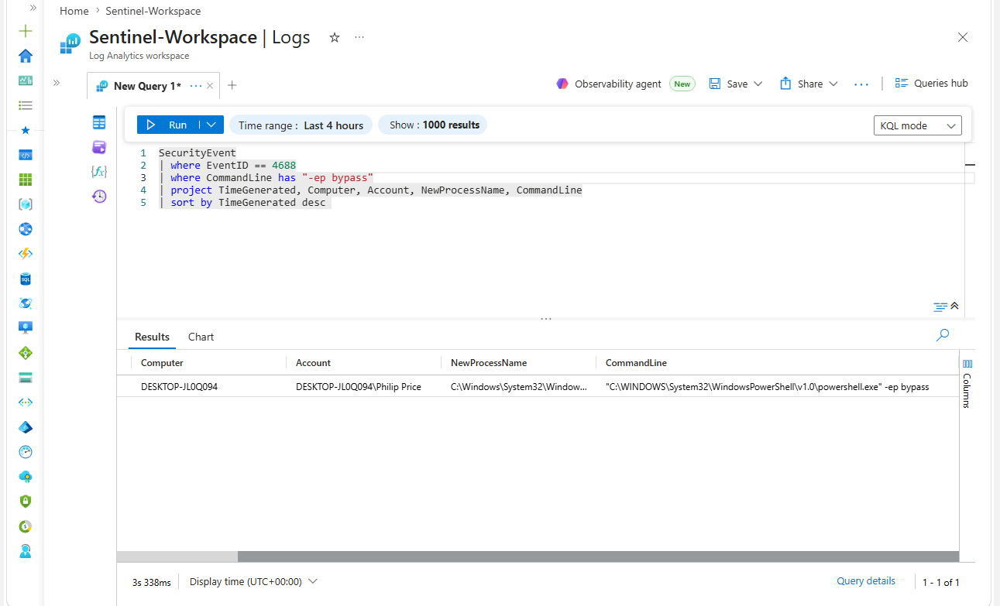

---

### 4. Failed Login Attempts

Repeated failed logins (Event ID 4625) were observed, consistent with credential stuffing or brute force behavior.

**KQL Query:**
```kql
SecurityEvent
| where EventID == 4625
| summarize FailedAttempts = count() by Account, Computer, bin(TimeGenerated, 5m)
| where FailedAttempts >= 5
| sort by FailedAttempts desc
```

**Results:** `Philip Price` on `DESKTOP-JL0Q094` recorded 6 failed attempts within a 5-minute window.

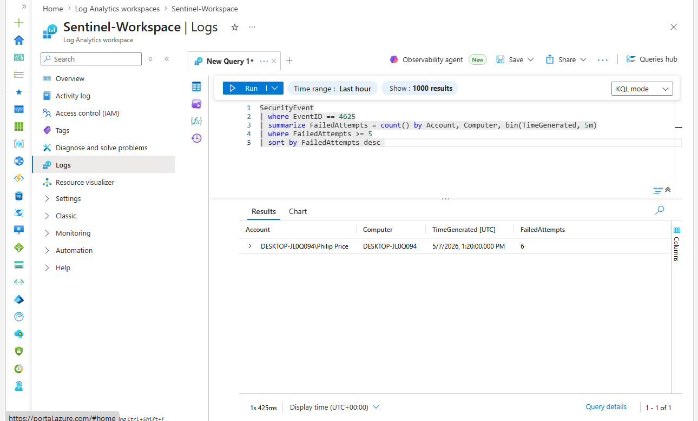

---

### 5. Full Process Creation Log (Event ID 4688)

A broad query was used to baseline all process creation activity on the endpoint, revealing 451 events including the PowerShell encoded command and bypass executions among normal system processes.

**KQL Query:**
```kql
SecurityEvent
| where EventID == 4688
| project TimeGenerated, Computer, Account, NewProcessName, CommandLine
| sort by TimeGenerated desc
```

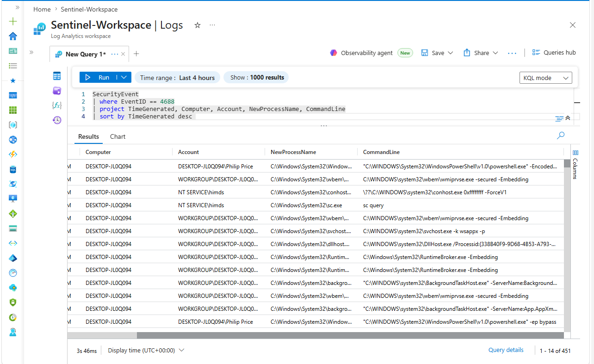

---

## 🚨 Analytics Rules

Two scheduled analytics rules were created in Microsoft Sentinel to automatically generate incidents from the detected patterns.

| Rule Name | Severity | Type | Status |
|---|---|---|---|
| Suspicious Encoded PowerShell Execution | High | Scheduled | Enabled |
| Multiple Failed Login Attempts Detected | Medium | Scheduled | Enabled |

**Initial rule deployment (1 rule):**

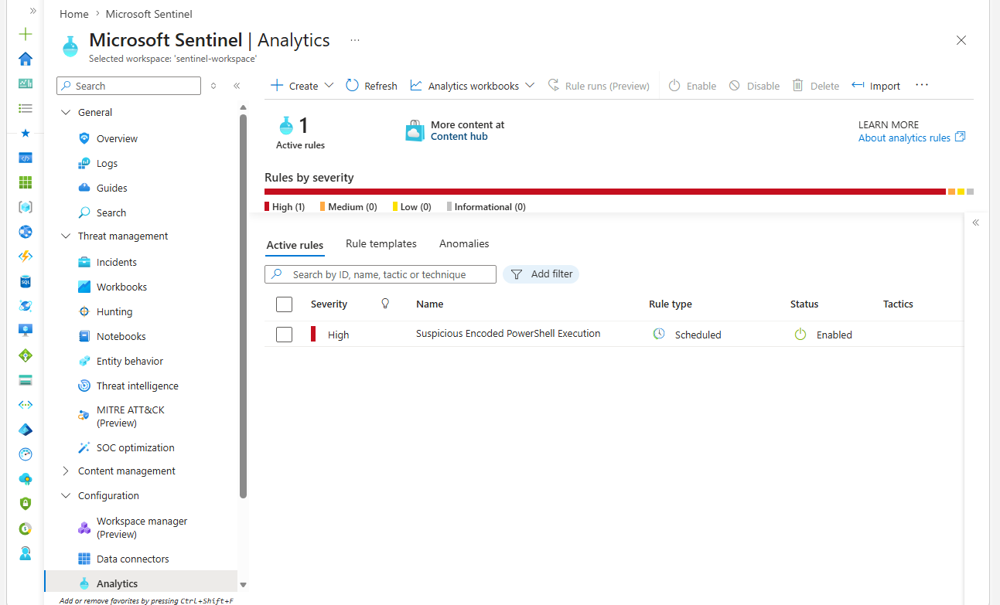

**After adding the failed login rule (2 rules active):**

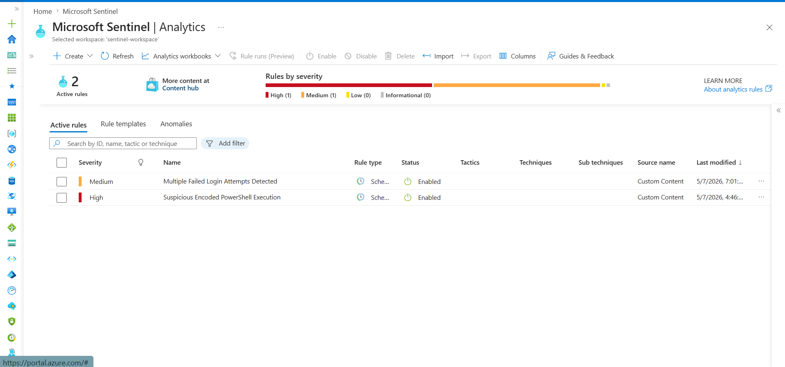

---

## 📋 Incidents

### Early Incidents (PowerShell Only)
The first two incidents were both **High** severity — `Suspicious Encoded PowerShell Execution` — generated automatically by the analytics rule.

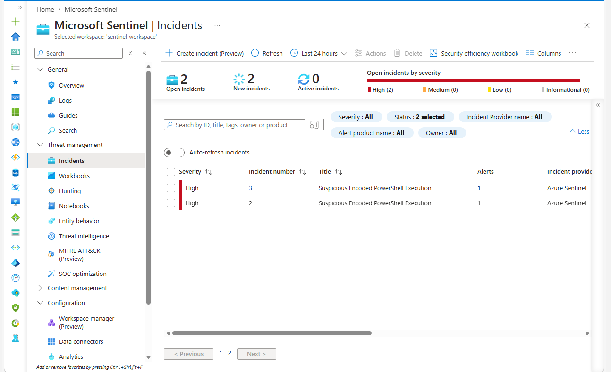

### Full Incident Queue (27 Open)
After both rules ran over time, the incident queue grew to **27 open incidents**: 12 High (PowerShell) and 15 Medium (Failed Logins).

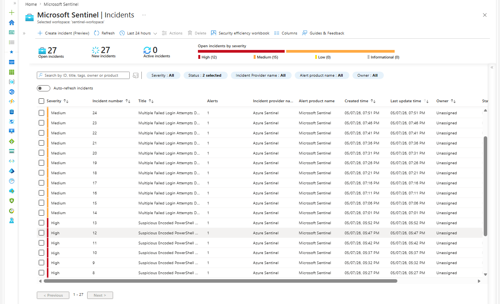

---

## 📊 SOC Workbooks

A custom **SOC Threat Monitoring Dashboard** workbook was built in Sentinel to visualize key signals over time.

### Failed Login Attempts Over Time
28 total failed logins visualized in a time-series chart. Peak observed at ~7:00 PM.

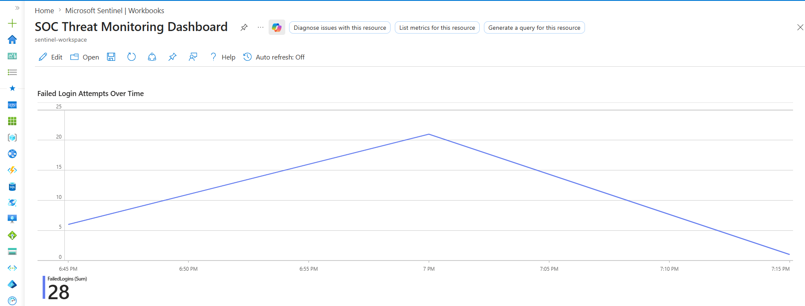

### PowerShell Execution Activity
30 total PowerShell executions plotted in a bar chart over several hours, showing sustained activity.

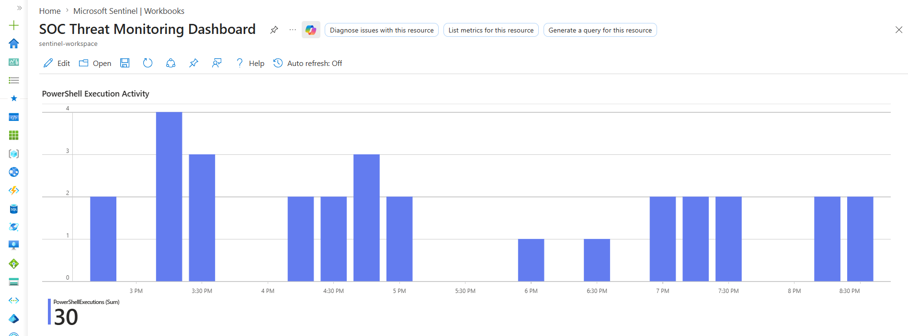

### Top Executed Commands
Most frequent process creations ranked by count, dominated by `conhost.exe 0xffffffff -ForceV1` (195 executions) and `RuntimeBroker.exe -Embedding` (79).

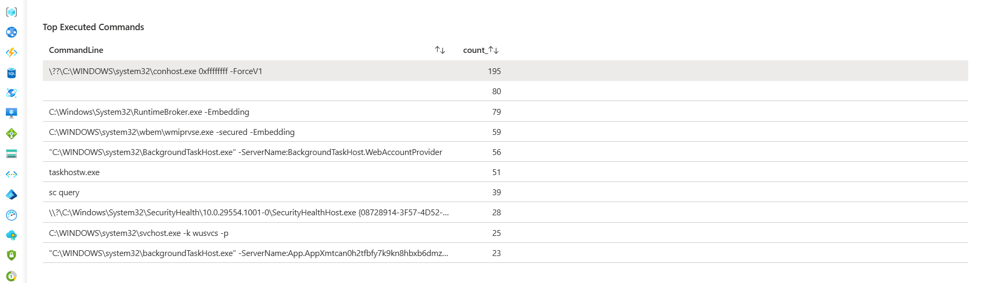

### Full Dashboard Overview
Combined view showing all three panels in the SOC dashboard.

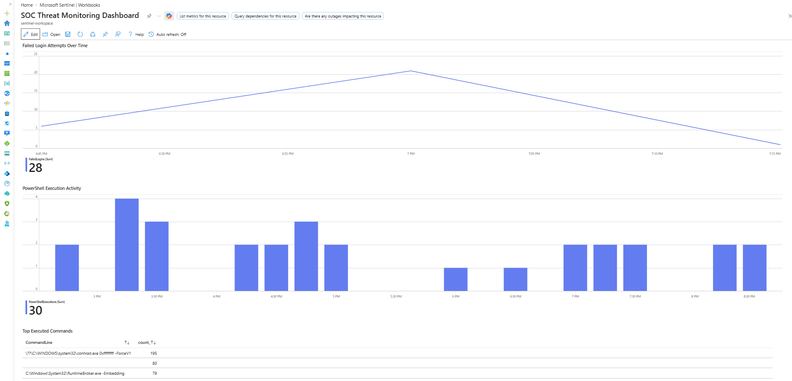

---

## 🛠️ KQL Queries Reference

All detection queries used in this lab are saved in the `/KQL-Queries` folder:

- `recon_detection.kql` — Detects whoami, ipconfig, net user, net localgroup
- `encoded_command_detection.kql` — Detects PowerShell `-EncodedCommand` flag
- `ep_bypass_detection.kql` — Detects PowerShell `-ep bypass` flag
- `failed_login_detection.kql` — Detects brute force patterns via Event ID 4625

---

## 🧰 Tools & Technologies

- Microsoft Azure
- Microsoft Sentinel (SIEM/SOAR)
- Log Analytics Workspace
- KQL (Kusto Query Language)
- Windows Security Event Logs (Event IDs: 4625, 4688)
- Sentinel Workbooks
- Sentinel Analytics Rules

---

## 📌 MITRE ATT&CK Techniques Covered

| Technique | ID | Description |
|---|---|---|
| Command and Scripting Interpreter: PowerShell | T1059.001 | PowerShell used for execution |
| Obfuscated Files or Information | T1027 | Encoded command to hide payload |
| Impair Defenses: Disable or Modify Tools | T1562 | Execution Policy Bypass (-ep bypass) |
| System Owner/User Discovery | T1033 | `whoami` command |
| System Network Configuration Discovery | T1016 | `ipconfig /all` command |
| Brute Force: Password Guessing | T1110.001 | Repeated failed login attempts |

---

## 📝 Notes

- All activity was performed in a controlled Azure lab environment.
- No real systems were compromised.
- The endpoint `DESKTOP-JL0Q094` and user `Philip Price` are simulated identities.
